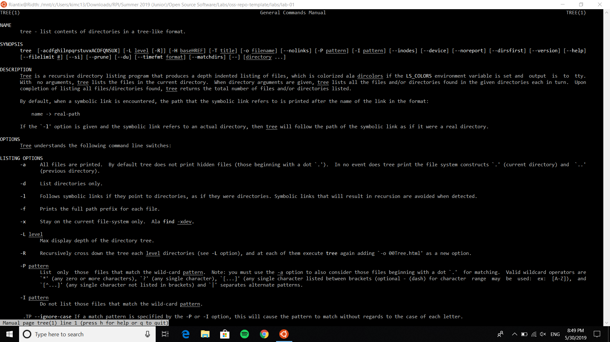
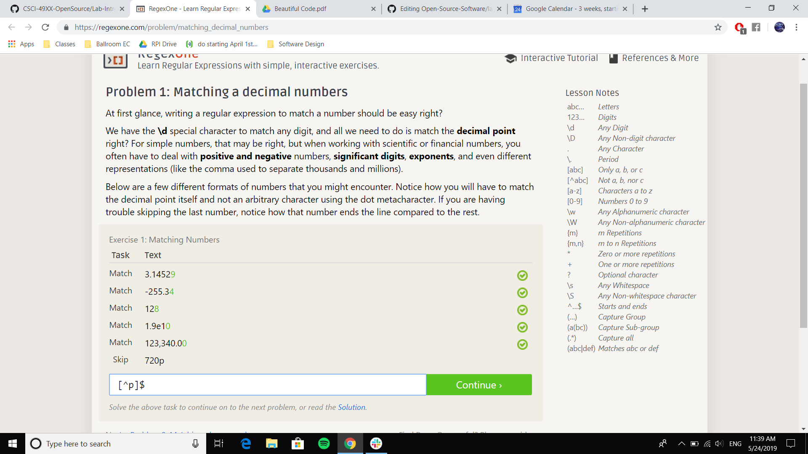
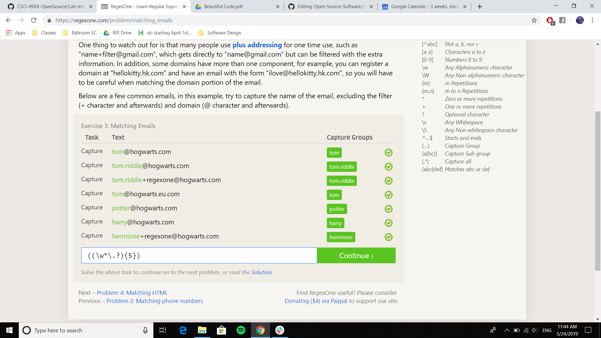
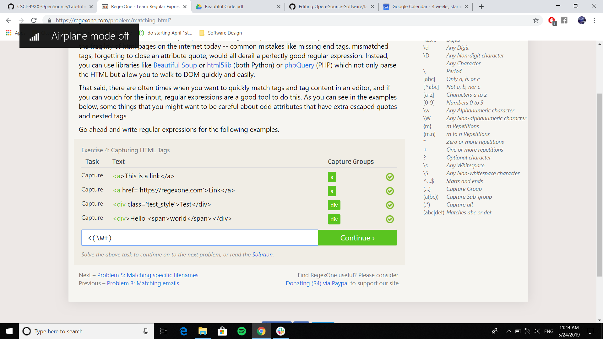
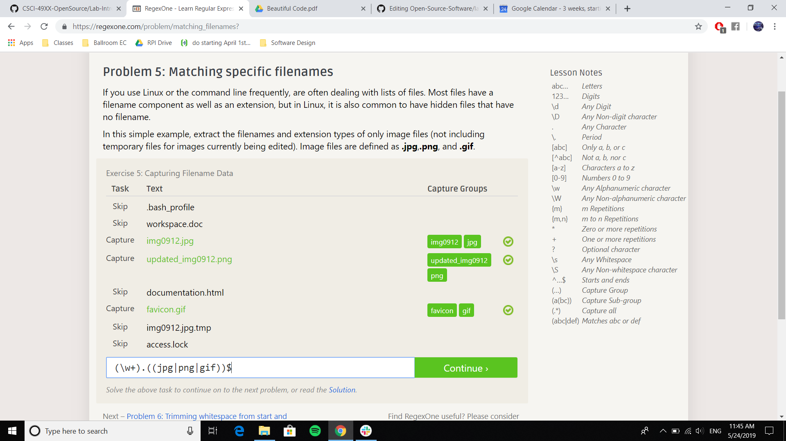
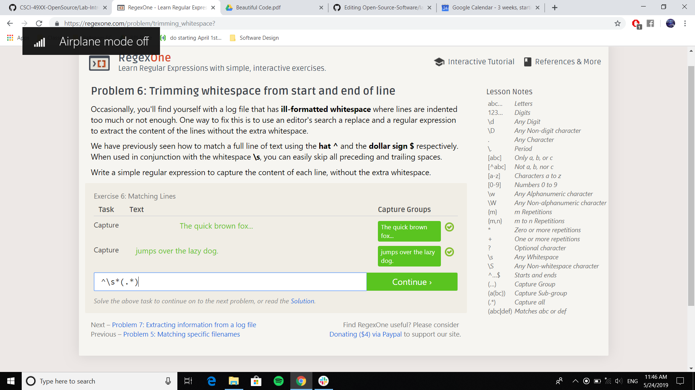
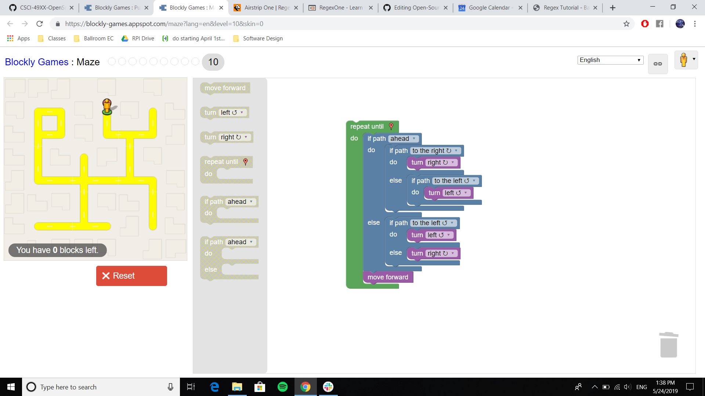

(7) Please read Eric Raymond's article Smart Questions How to ask the question The Smart Way .
Do you have more suggestions for How To Answer Questions in a Helpful Way (from your past experience)
List at least two:

   1. One suggestion is a section explaining the right mindset before you ask. The author mentions this occasionally in his article 
   
   (e.g. "Remember: When that hacker tells you that you've screwed up, and (no matter how gruffly) tells you not to do it again, 
   he's acting out of concern for (1) you and (2) his community. It would be much easier for him to ignore you and filter you out of his 
   life. If you can't manage to be grateful, at least have a little dignity, don't whine, and don't expect to be treated like a fragile doll
   just because you're a newcomer with a theatrically hypersensitive soul and delusions of entitlement.").
   
   Mentioning in one place that you are coming for help, that nobody is required to help you, and that people are using their precious
   time to help you can frame a respectful mindset and curb laziness. The author does mention this in the introduction, but that section
   seems more for a disclaimer and less to help with framing a quesiton.
   
   2. The article seems very open-ended on who this is meant to address. As it pertains to hackers, much of the article talks about
   asking questions to hackers, but still leaves it open-ended enough to address anyone asking a question. A short section indicating
   who this is meant for can both help the reader, and future editors in narrowing the scope and being more specific. For instance,
   a programmer would definitely find this article useful, but a garderner may not... despite the article leaving space for them to
   take away something.
   
   In short, I am suggesting the author either limits the audience, or clearly indicate a large audience and broaden the scope more to
   focus less on hackers and more on users who are answering in general.
   
   
(8) Write a short paragraph ( 8 to 10 sentences) of what you got out of reading that chapter.

   The problem lies with whoever put copyrighted music onto the RPI network. Or, the copyright itself dealing with music on
   private network. That depends on whether it addresses copyrighted music on network. That aside, this is my stance on both
   perspectives:
   
   First, the article is heavily biased towards Jesse. I just wanted to throw that out there before I state my views.
   
   From Jesse's perspective, this is outrageous. He had no intention of accessing illegal material, and he had no intention of
   doing anything with music whatsoever. He did not even think of accessing music. All he wanted to do was tinker with the engine.
   
   From the company's perspective, this has less to do with Jesse's specific situation and instead future matters that may reference this
   incident. I am not sure where $15,000,000 came from -- perhaps that is the regular fee, or perhaps that's just a grossly estimated
   sum to scare Jesse. Probably the latter. Who knows? Regardless, they settled for how much Jesse had, the max they can claim while
   putting a hard line. If he had $1,000 they probably would've settled for that as well. It matters not how much he had, but rather
   that it was everything so that future transgressors do not follow in his footsteps.
   
   Of course, if the focus was on whoever put it on the private network, or the copyright dealing with that, this could've been avoided.
   In my opinion, neither are in the wrong.
   
   
(13) 

(15) 

(16) 

(18) 
   
(19) Reflection: 
   I think Cybernetics Core from RCOS would be interesting to look at, but it's decidedly sparse. GEM-UNIVERSE from RCOS also seems interesting. I am interested in seeing more open source programs outside of RCOS but many seem extremely complicated to get to know. Ultimately though, I am interested in projects revolving around games. One idea in the back of my head is an adaptive rpg based on user feedback that will modify difficulty in various ways. For instance, if the enemies kill the player too quickly, either enemy damage or player health can be modified. Elements and resistances, more abilities, or minigames can be considered. The project will have to be extremely large relative to the game user plays for it to have "unlimited" options.
